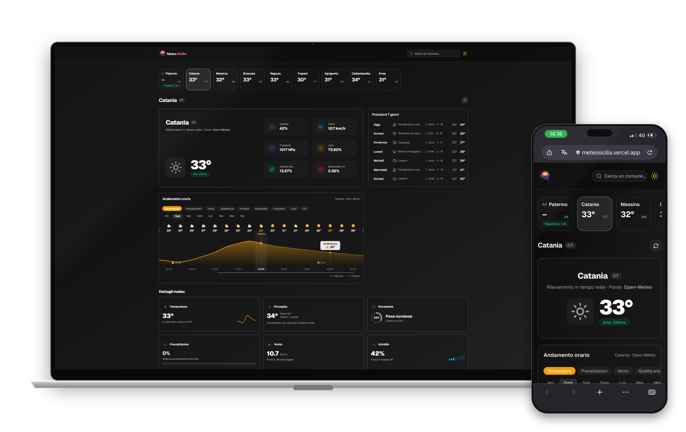
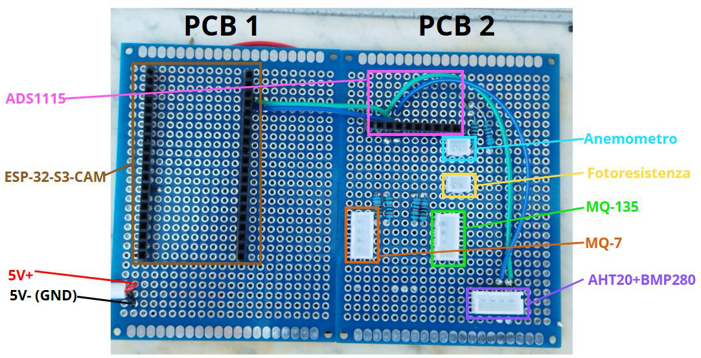
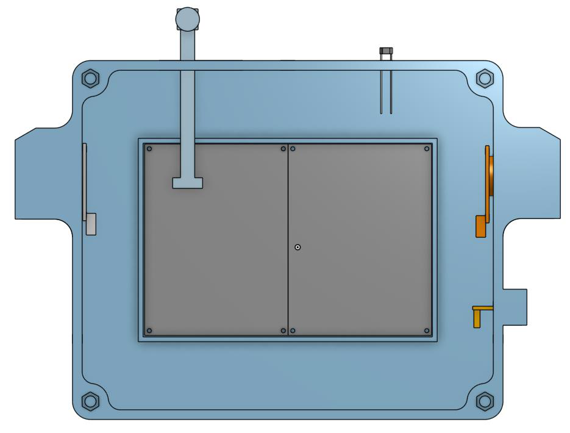
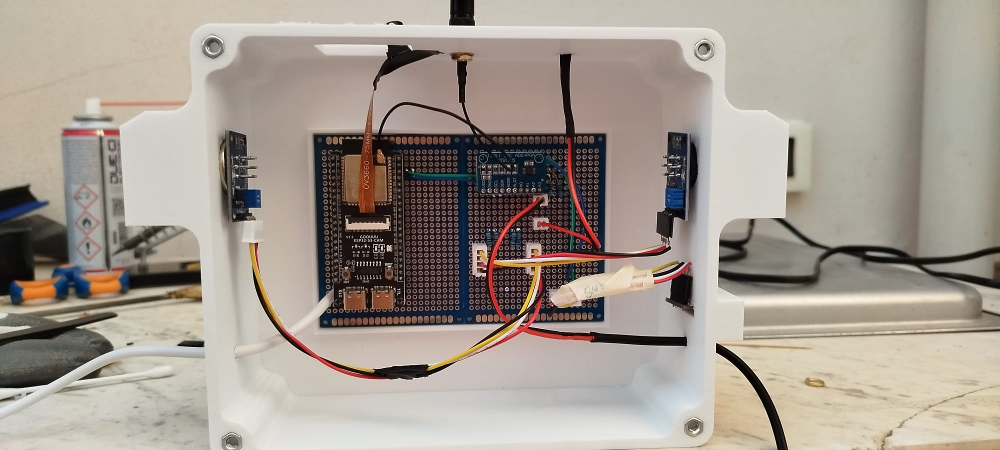
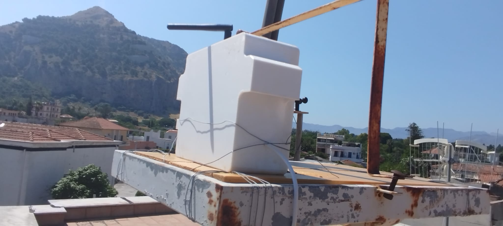
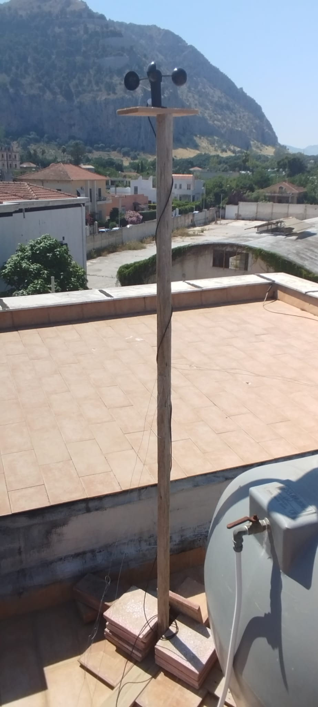
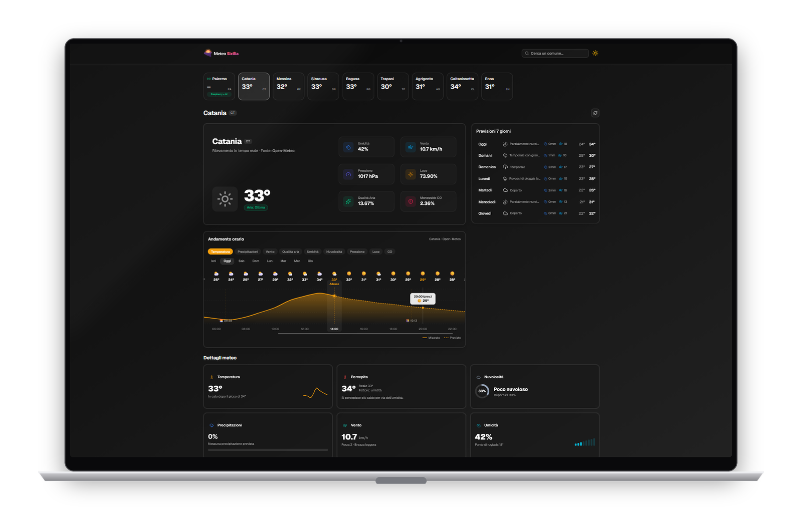
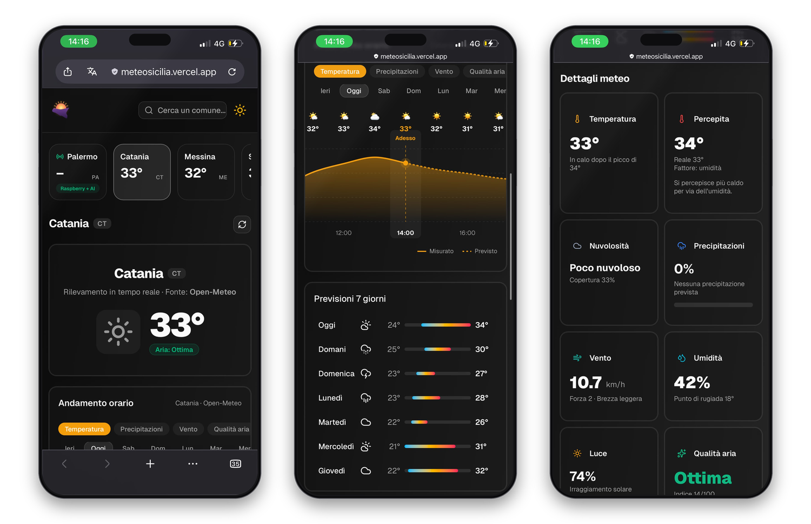
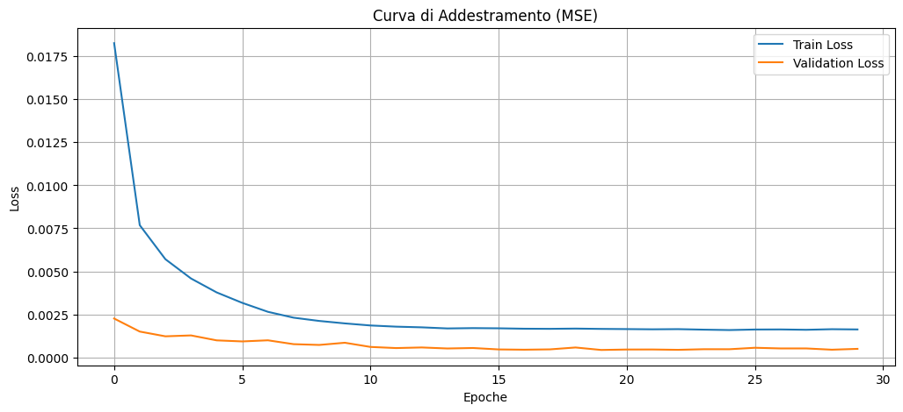
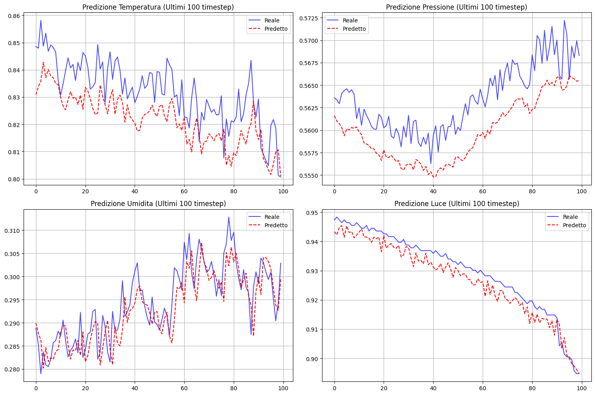

# Meteo Sicilia

Real-time weather for Sicily, built on top of a weather station we designed, soldered and put on a roof in Palermo.

**Live:** [meteosicilia.vercel.app](https://meteosicilia.vercel.app)




---

## What this is

Most weather sites are a nice frontend on top of somebody else's API. This one starts from an actual sensor.

A station we built reads temperature, humidity, pressure, wind, light, air quality and carbon monoxide, takes a picture of the sky, and pushes everything over MQTT to a backend that stores it and streams it to the website in real time. For Palermo — the city where the station sits — the numbers you see on screen are the numbers the sensors measured a few seconds ago. For every other Sicilian town we fall back to Open-Meteo, which is free, professional and doesn't need an API key.

So there are three layers to the project: the hardware, the backend, and the web app. They were built more or less in parallel and had to agree with each other the whole way, which turned out to be the hard part.

---

## The station

The station is split in two. A **Raspberry Pi** acts as the station's computer: it runs the Mosquitto MQTT broker, the FastAPI server, the SQLite database and the camera pipeline. An **ESP32-S3-CAM** does the sensing: dual-core at 240 MHz, 16 MB of flash, Wi-Fi with an external antenna, and an OV3660 3 MP camera that photographs the sky once per reading cycle.

| Sensor | Measures | Interface |
|---|---|---|
| BMP280 + AHT20 | temperature, pressure, humidity | I²C |
| Anemometer | wind speed (km/h) | analog → ADS1115 |
| LDR photoresistor | light intensity (%) | analog → ADS1115 |
| MQ-135 | air quality (ppm) | analog → ADS1115 |
| MQ-7 | carbon monoxide | analog → ADS1115 |
| ADS1115 | 16-bit, 4-channel ADC | I²C |

Everything digital shares a single I²C bus (SDA on pin 2, SCL on pin 1), and everything analog goes through the ADS1115 rather than the ESP32's own ADC, which is noisy and gets unusable while Wi-Fi is transmitting.

### The boards

Two 6×8 cm perfboards, hand-soldered. The first carries the ESP32 and the power rails, the second the ADC, the sensor headers and the voltage dividers.



### The enclosure

The case was modelled in Onshape and 3D-printed in PETG — PLA would have warped in a Palermo summer. It has openings for the sensors that need airflow, a pass-through for the camera ribbon, and a removable lid so we could get back inside without unmounting the whole thing from the roof. We needed that more often than we'd like to admit.




### Installed




The anemometer sits on its own mast, away from the box, so the enclosure doesn't shield it from the wind.

---

## Architecture

```
┌──────────────────┐   MQTT    ┌──────────────────┐  HTTP / SSE  ┌───────────────────┐
│ Physical station │ ────────▶ │     Backend      │ ───────────▶ │     Frontend      │
│  RPi + ESP32-S3  │           │ FastAPI (Python) │              │ React + TypeScript│
│  Sensors + cam   │           │   SQLite · SSE   │              │  PC/tablet/phone  │
└──────────────────┘           └──────────────────┘              └───────────────────┘
                                        ▲                                  ▲
                                        │                                  │
                                 ┌──────────────┐                  ┌──────────────┐
                                 │  LSTM model  │                  │  Open-Meteo  │
                                 │  (Palermo)   │                  │(other towns) │
                                 └──────────────┘                  └──────────────┘
```

Each reading cycle, the ESP32 assembles a JSON payload and publishes it to `stazione1/sensori`; sky images go to `stazione1/immagini`. The backend subscribes to both. The station publishes and the server subscribes — neither one needs to know the other's address, which is what makes adding a second station later a configuration problem instead of a rewrite.

The backend writes every message into a SQLite table (`dataset`, one column per measured quantity, timestamp as primary key) through `aiosqlite`, saves the image to disk linked to its timestamp, and re-broadcasts the reading to connected browsers over **Server-Sent Events**. No polling, no WebSocket handshake, no page reloads: the number on screen just changes.

### Endpoints

| Endpoint | What it returns |
|---|---|
| `GET /last_read` | the most recent sensor reading |
| `GET /sse` | live channel, one event per new measurement |
| `GET /storico/oggi` | today's readings (feeds the Palermo chart) |
| `GET /previsione/oggi` | AI forecast for the remaining hours *(wired up, model not connected yet)* |

---

## The web app



The frontend is React 19 + TypeScript on Vite, styled with Tailwind v4 and a few shadcn/ui components. The visual identity is built around a Sicilian sunset: orange to pink to violet, glass-style translucent cards, light and dark themes using `oklch` so the hues stay even in both.

The logo is the outline of the island with the sun setting behind it, reconstructed from 19 real coastal coordinates — Capo Peloro, Marsala and Capo Passero are the three corners of the Trinacria, and the rest are smoothed into curves between them. It's inlined as SVG in the React tree rather than loaded as a file, so the word "Meteo" can inherit `currentColor` and flip automatically between themes. One logo, both backgrounds.

### The hourly chart

The chart is drawn by hand in SVG. No charting library.

- 9 selectable metrics: temperature, precipitation, wind, air quality, humidity, cloud cover, pressure, light, CO
- day navigation from yesterday to six days ahead
- tooltip on hover and on touch, with hour, value and weather icon
- sunrise and sunset markers, plus an "Adesso" line on the current hour
- smooth curves via Catmull-Rom splines converted to Bézier
- horizontal scroll that auto-centres on the current hour, which is what you want on a phone
- **solid line for measured data, dashed for forecast** — so you can tell at a glance what is fact and what is a guess

It's wrapped in an error boundary. If something in there ever throws, you get a small message in the chart's place instead of a blank page.

### Weather details

Below the chart, a row of cards that compute derived values rather than just repeating the raw ones:

- **Feels-like** temperature (heat index or wind chill depending on conditions)
- **Dew point** via the Magnus formula
- **Beaufort scale**, wind speed translated into force and description
- **Sky state and air quality**, percentages turned into readable labels and colours
- **Trends**, rising or falling for temperature and pressure, with the time of the next peak

All the small graphics in those cards are inline SVG too. Light, sharp on any display, no dependencies.

### On a phone



Same app, same code. On narrow screens the three-column grid collapses into a single ordered column, the hero centres the temperature, the detail cards drop to two across (one on the narrowest phones, so the numbers never get cut), and the chart scrolls inside itself instead of stretching the page.

### The Palermo case

Palermo doesn't behave like the other towns, and this is deliberate. Since the station is there:

- **current conditions** come from the sensors over SSE
- **the hourly series** combines real sensor history for the past and the AI forecast for the hours ahead
- **the sky photo** comes from the station's camera
- **7-day forecasts** still come from Open-Meteo, because that's well outside what a single station can tell you

Every other town goes to Open-Meteo for everything. The routing lives in dedicated React hooks, so the rest of the app — search, city strip, chart, details — doesn't need to know where its data came from.

### PWA

It's installable. Add to Home Screen on iOS, Install App on Android, and it opens fullscreen with its own icon, no store involved. Web app manifest, dedicated icon set including the Apple touch icon, iOS meta tags for the title and status bar.

---

## The AI model

The forecasting model is a multivariate **LSTM** trained on the station's own data: around 18,000 records, merged from two datasets collected by our class and the parallel one, cleaned up, field names normalised, then Min-Max scaled.

It uses four features — temperature, light, pressure, humidity — and predicts the following hours. Validation is chronological (TimeSeriesSplit, because shuffling a time series is cheating), Adam optimiser, MSE loss, early stopping.




It tracks temperature and light well and lags a bit on pressure, which is honest for the amount of data we have. The model is trained and evaluated; connecting it to `/previsione/oggi` is the next step. Until then the app falls back to the Open-Meteo hourly forecast for Palermo's future hours, so the site is never broken while we finish it.

---

## Tech stack

**Hardware** — Raspberry Pi, ESP32-S3-CAM, OV3660 camera, BMP280, AHT20, MQ-135, MQ-7, ADS1115, anemometer, LDR. Perfboard, PETG enclosure modelled in Onshape.

**Backend** — Python, FastAPI, Mosquitto (MQTT), SQLite via aiosqlite, Server-Sent Events.

**Frontend** — React 19, TypeScript, Vite, Tailwind CSS v4, shadcn/ui, React Router. Charts and icons hand-written in SVG.

**AI** — TensorFlow/Keras LSTM, pandas, scikit-learn.

**Infra** — GitHub, Vercel, Cloudflare Tunnel, Let's Encrypt.

---

## Project structure

```
Meteo_Project/
├── frontend/                 # web app (Vite + React + TypeScript)
│   ├── public/               # logo, favicon, PWA icons, manifest
│   └── src/
│       ├── api/              # Open-Meteo integration
│       ├── components/ui/    # header, chart, details, cards, logo…
│       ├── hooks/            # data routing (Palermo / Open-Meteo)
│       ├── pages/            # dashboard and single-town page
│       └── types/            # shared TypeScript types
└── backend/
    └── app.py                # FastAPI server (MQTT, SQLite, SSE, endpoints)
```

---

## Running it locally

**Requirements:** Node.js 18+, Python 3.10+.

```bash
# frontend
cd frontend
npm install
npm run dev        # http://localhost:5173
```

```bash
# backend
cd backend
pip install fastapi uvicorn aiosqlite paho-mqtt
uvicorn app:app --reload
```

One thing worth knowing: you can't just double-click `index.html` to try the built site. Modern JavaScript modules refuse to run from `file://` for security reasons, so you get a blank page and no obvious error. Use `npm run preview` instead.

---

## Deployment and security

The frontend is on **Vercel**, connected to this repository. Root directory is `frontend`, Vite preset, and every push to the main branch triggers a rebuild and redeploy. HTTPS comes with it.

The station's backend runs at home, which is the part that needs care:

| Concern | What we did |
|---|---|
| Traffic encryption | HTTPS/TLS (Vercel, plus Let's Encrypt on the station side) |
| Exposing the station | **Cloudflare Tunnel** — no ports opened on the router, home IP never exposed |
| Domain | WHOIS privacy and registrar transfer lock |
| API access | CORS configured to allow only the frontend origin |

A tunnel was the right call here. Port-forwarding a Raspberry Pi in somebody's house to the open internet is how you end up in a botnet.

---

## Things that went wrong

Worth writing down, since they took longer than the features did.

**The chart library turned the whole page white.** We started with a popular charting library that turned out to be unstable with our build setup — not an error in the console, just a blank render. We pulled it out and wrote the chart in raw SVG. It cost a couple of days and ended up better: total control over the look, better performance, and it behaves correctly on phones.

**On mobile, the layout was squashed to the left.** The chart contains a very wide drawing inside a scrollable container, and CSS grid columns won't shrink below their content by default. So the drawing was forcing the entire page to its own width, and on a phone you saw a slice of it. The fix was one line — `min-width: 0` on the columns — but finding it meant actually understanding how grid sizing works.

**Phones were translating the site from English.** The page was declared as `lang="en"` while being written in Italian, so automatic translation on some phones "translated" it into nonsense — *Temperatura* became *Cucina*. Setting `lang="it"` fixed it, and as a bonus people who do want it in another language now get a correct translation.

**Inherited tutorial code.** Early on the project carried over scaffolding from tutorials, with references to functions and data that didn't exist, and it wouldn't compile. We cleaned it out and rebuilt the pages on the architecture we actually had. The rule we kept afterwards: the app shows the quantities the sensors really measure, and nothing else.

**Backend changes stayed additive.** The MQTT logic, the storage code and the table schema were working, so we didn't touch them. Enabling CORS and adding the two Palermo endpoints were pure additions. Nothing that was already reading sensors correctly got refactored for tidiness.

---

## Roadmap

- [ ] connect the LSTM to `/previsione/oggi`
- [ ] more stations in other Sicilian cities (the structure already allows it)
- [ ] weather alerts and better offline behaviour for the PWA
- [ ] historical statistics: averages, records, period comparisons
- [ ] sky-image gallery synced with the readings
- [ ] language selector

---

## Who built it

**Matteo Carpino** · **Giansalvo Ciavarello** · **Marco Lo Cascio**

We built this together, all three of us across all three layers — we were in the same room for the soldering, the debugging and the deploys, and every significant decision was made jointly. That said, each of us pulled harder where we were strongest:

- **Matteo Carpino** — software development, frontend and backend. The React app, the SVG chart, the data routing between sensors and Open-Meteo, the FastAPI endpoints and the SSE channel, plus the visual identity and the deployment. Also spent a fair amount of time with a soldering iron on the boards.
- **Giansalvo Ciavarello** — the AI side and software. Dataset work, the LSTM model, training and evaluation, and the data pipeline feeding it.
- **Marco Lo Cascio** — hardware. Sensor selection and wiring, the perfboards, the CAD enclosure and the physical install, and keeping the project's planning on track.

Project developed at I.I.S.S. Majorana, Palermo — school year 2025/2026.

---

## License

MIT.
